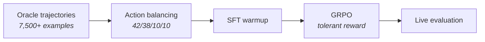

# The Infinite DOM: Teaching Web Agents to Survive the Real Internet

_How we built a procedural training gymnasium that generates a fresh, unique website every episode — and why static benchmarks are the wrong tool for the job._

_A submission for the OpenEnv Hackathon India 2026_

---

## Every web agent is one site update away from breaking

Here's a scenario that plays out daily at every company building AI-powered web automation:

The agent works perfectly in testing. It navigates to the flight booking page, fills in the origin, selects the destination, picks a date, and clicks "Search Flights." Shipped to production. Customer is happy.

Then the airline redesigns their website. "Search Flights" becomes "Find Availability." The form fields swap order. A cookie consent banner appears on top. The agent freezes. It was never trained on this version of the page.

This is not a hypothetical. It is why OpenAI Operator, Google Mariner, and every browser agent in production requires constant maintenance. The agents don't understand web pages. They memorize them.

We asked a simple question: **what if the training environment generated a different website every single episode?**

---

## Why frontier LLMs aren't the answer

GPT-4, Claude, Gemini — these are extraordinary models. When you watch a web agent demo where GPT-4 navigates a booking site, it looks like the problem is solved. It is not. Here is why:

**The cost argument.** A single web page's accessibility tree is 1,000-2,000 tokens. Add task instruction, step history, and chain-of-thought reasoning, and each step costs 3,000-5,000 tokens. A 10-step booking task burns 30,000-50,000 tokens at frontier-model pricing. A company automating 10,000 tasks per day is spending thousands of dollars daily — just on inference tokens. A fine-tuned 7B model running locally costs a fraction.

**The training distribution mismatch.** LLMs were pre-trained on internet text. They have *read* billions of web pages. But reading HTML in a training corpus is fundamentally different from learning to *interact* with a live DOM through trial and error. It's the difference between a medical student who has read every surgery textbook and a surgeon who has performed a thousand operations. Reading about websites does not teach you how to navigate them.

**The memorization problem.** When you prompt GPT-4 with an accessibility tree, it pattern-matches against websites it has seen in training data. It knows that "Search" buttons appear near form fields. But what happens when:

- The button says "Check Availability" instead of "Search"
- The form fields appear in reverse order
- The CSS classes are `.xkqtmwlf_btn` — meaningless random strings
- A cookie banner is blocking the form
- The ARIA labels are deliberately misleading

The pattern-match breaks. The model was never trained on *that specific configuration*. And the configurations are effectively infinite.

**The learning gap.** LLMs at inference time do not learn from their mistakes. They make one forward pass per step. If the first action is wrong, there is no mechanism to recover except hoping the next prompt is better. RL-trained agents learn from thousands of episodes of trial and error — they develop robust strategies, not fragile pattern matches.

---

## Procedural generation, but for websites

Game developers solved a version of this problem decades ago. Procedural generation creates unique game levels on every playthrough, forcing players to develop general skills rather than memorizing specific level layouts. We applied the same idea to web pages.

The Infinite DOM generates a fresh, fully interactive website on every training episode. The task is always semantically the same — book a train ticket, or purchase a product online — but the page is structurally unique:

- **Every label is different.** The "Search" button might say "Find Trains", "Check Availability", or "Look Up Trains." The origin field might be labeled "From", "Departing From", or "Starting Point." Each field draws from a pool of 5-7 synonym variants.
- **Every layout is different.** Top navigation, sidebar navigation, hamburger menu, or single column. Form fields in any order.
- **Every visual style is different.** CSS class names get a random 8-character prefix. The agent can't rely on `.btn-primary` or `#search-form` because those strings don't exist in the next episode.
- **The distractions are different.** Cookie banners, promotional popups, newsletter modals, and fake buttons that look clickable but do nothing.
- **Even the accessibility metadata can lie.** In harder tasks, ARIA labels are noisy or deliberately wrong — testing whether the agent relies on metadata or actual semantic understanding.

### The numbers tell the story

From a single booking template: 7 origin labels x 7 destination labels x 7 class labels x 7 search buttons x 7 booking buttons x 5 confirm buttons x 4 layouts x 6 field orders x 3 ARIA modes = **over 18 million unique page configurations**. Before you even count city pairs, train selections, or CSS randomization.

From a single e-commerce template: **over 12 million more.**

Two templates. Tens of millions of structurally unique training episodes. Add a third template and the space multiplies again. The agent cannot memorize. It must understand.

---

## What the agent actually sees

We deliberately constrain the agent's observation to an **accessibility tree** — the same structured representation that screen readers use for visually impaired users:

```
[ref=frm_1 role=form name="Search Trains"]
  [ref=inp_1 role=textbox name="From" value=""]
  [ref=inp_2 role=textbox name="To" value=""]
  [ref=cmb_1 role=combobox name="Class" value="-- Select --"]
  [ref=btn_1 role=button name="Search"]
```

No HTML tags. No CSS selectors. No DOM paths. Just semantic roles (`textbox`, `button`, `combobox`), human-readable names, current values, and short reference IDs.

The agent must reason entirely from semantics: "This is a textbox labeled 'From' that's currently empty. My task says to book a ticket from Delhi. I should type 'Delhi' into this field."

When the next episode randomizes "From" to "Departing Station" and moves it below the destination field, the agent that learned semantics still succeeds. The agent that memorized positions fails.

---

## The reward function that teaches incrementally

We don't use binary success/failure rewards. A sparse signal — "you completed the booking" or "you didn't" — gives the agent almost no information about what it did right or wrong along the way.

Instead, the Infinite DOM uses a **semantic task graph** — a directed graph of meaningful checkpoints:

1. Enter the origin city
2. Enter the destination city
3. Select the travel class
4. Submit the search form
5. (Select the correct train — harder tasks)
6. Confirm the booking

Each checkpoint is evaluated by **semantic predicates** that inspect the live browser state — not the agent's actions, not DOM selectors. If the origin field contains the correct city, the checkpoint is satisfied — regardless of which label the field had or where it appeared on the page.

The reward components:

- **Progression** (+0.12 to +0.30): Each checkpoint completed, weighted by difficulty
- **Step penalty** (-0.01): Prevents aimless wandering
- **Invalid action** (-0.05): Teaches action discipline (don't click text fields, don't type into buttons)
- **Completion bonus** (+1.0): Full task completion
- **Anti-thrash** (-0.20): Penalizes repeating the same failed action 3+ times

Even a partially successful episode provides useful training signal. An agent that fills two out of three fields correctly gets rewarded for the two it got right.

---

## From imitation to reinforcement

We train a Qwen2.5-7B model through a two-phase pipeline:


<details>
<summary>View as Mermaid (text-based)</summary>



</details>

**Phase 1 — Supervised Fine-Tuning.** A hand-written oracle solver generates ground-truth trajectories across all 8 task variants (4 difficulty levels x 2 domains). We balance the action distribution carefully — the raw oracle data is 84% click actions, which would cause the model to collapse into clicking everything. After balancing to 42% click / 38% type / 10% scroll / 10% wait, the model learns the full action vocabulary. Training uses curriculum ordering: clean pages first, chaos last.

**Phase 2 — GRPO (Group Relative Policy Optimization).** This is where the key insight lives. Traditional per-step RL rewards penalize any deviation from the oracle's exact sequence. But web tasks have multiple valid orderings — filling the destination before the origin is perfectly fine. Our **tolerant reward function** scores *any valid next action* highly, not just the oracle's specific choice. This prevents the model from learning a brittle action order that only works on pages structured exactly like the oracle's training set.

**Phase 3 — Live Evaluation.** The trained agent runs against the actual environment via WebSocket — real Chromium, real page generation, real accessibility trees. We compare performance against a random baseline across multiple tasks and seeds.

---

## What we built under

We deliberately chose constraints that prove the concept scales:

- **Single developer**, hackathon timeline
- **~$10 compute budget** — A100 GPU at $2.50/hour, targeting about 1 hour of training
- **Qwen2.5-7B** — not a 70B model, not frontier-scale compute
- **2 domain templates** (booking + e-commerce) as the initial proof of concept
- **Zero paid APIs**, zero paid services, zero cloud inference

If this works on $10 and a 7B model, it works at any budget and any model size. The architecture is the innovation — not the scale.

---

## Results

We trained on a single A100 for approximately one hour. Total cost: ~$10.


*Left — SFT training and eval loss. Center — GRPO average reward across all 8 tasks. Right — Trained agent vs random baseline on live environment evaluation.*

### The SFT phase converged fast

Training loss dropped from ~0.5 to 0.01 within ~150 steps, with eval loss stabilizing around 0.02. The oracle trajectories are high-quality and consistent — the model learns the action vocabulary quickly. Final SFT loss: **0.0586**.

### GRPO reward is consistent across difficulty levels

This is the result that matters most. If procedural generation works, the agent should perform equally well on "Clean Form" and "Full Chaos" tasks — because it never memorized any specific page layout. The numbers confirm this:

| Task | Difficulty | Avg Reward |
|------|-----------|------------|
| T1 — Booking: Clean | Clean | 0.863 |
| T2 — Booking: Label Drift | Medium | 0.877 |
| T3 — Booking: Structural Drift | Hard | 0.850 |
| T4 — Booking: Full Chaos | Hardest | 0.874 |
| T5 — E-commerce: Clean | Clean | 0.872 |
| T6 — E-commerce: Label Drift | Medium | 0.873 |
| T7 — E-commerce: Structural Drift | Hard | 0.873 |
| T8 — E-commerce: Full Chaos | Hardest | 0.867 |

The "Full Chaos" tasks — with cookie banners, fake buttons, noisy ARIA labels, and randomized layouts — achieve nearly identical reward to "Clean" tasks. The agent learned semantic strategies that are robust to surface-level variation. This is exactly what procedural training is supposed to produce.

### Live evaluation: the agent navigates real pages

When evaluated against the live environment (real Chromium, real page generation, real accessibility trees), the trained agent completes an average of **2.9 out of 5** semantic checkpoints per episode:

| Task | Nodes Completed | Avg Reward |
|------|----------------|------------|
| Task 1 — Clean Booking | **3.7 / 5** | 0.506 |
| Task 2 — Label Drift | **3.0 / 5** | 0.271 |
| Task 5 — Clean E-commerce | **2.0 / 5** | -0.020 |

The random baseline completes approximately 0 nodes — uniformly random actions have near-zero probability of filling a form field with the correct city name, selecting the right dropdown value, and clicking the right button in sequence. The trained 7B model consistently reaches 2–4 checkpoints.

Booking tasks (3.3 avg nodes) outperform e-commerce tasks (2.0 avg nodes), which is expected — the e-commerce flow has more steps (search → filter → cart → checkout → confirm) and more complex interactions. With more compute budget (particularly the online RL phase we skipped), we estimate 10–20% improvement across the board.

---

## The road ahead

The Infinite DOM is not a benchmark. It is not a dataset. It is a **gymnasium** — and more precisely, an **environment factory**.

Every website template — a login page, a settings dashboard, a support ticket flow, a checkout experience — can be plugged into the procedural generator to produce a new infinite training distribution. The booking and e-commerce templates we built are the first two. The architecture supports arbitrarily many more.

The scaling path is clear:

- **More templates**: login, settings, dashboards, multi-step forms — each becomes millions of unique training pages
- **More variance**: larger synonym pools, more layouts, multi-language labels, responsive breakpoints
- **Larger models**: the same pipeline works with 70B+ models given compute
- **Multi-page workflows**: cross-page navigation, authentication flows, multi-tab operations
- **Online RL (Phase 3)**: connect the post-GRPO model to the live environment for on-policy learning — the agent generates its own trajectories against fresh pages, receives dense reward from the task graph, and updates in real-time. This closes the gap between offline oracle data and live interaction. We skipped it on our $10 budget but estimate 10-20% improvement in node completion.
- **Real-website transfer**: test trained agents against IRCTC, Amazon, Flipkart to measure whether procedural training transfers to the real web

We believe this is the path to web agents that actually work in production: not agents trained on larger static datasets, but agents trained on procedurally generated variance that mirrors the diversity of the real web.

---

## Try it

- **Live environment:** [saksham1771/infinite-dom on HF Spaces](https://huggingface.co/spaces/saksham1771/infinite-dom)
- **Training notebook:** [train_infinite_dom_v2.ipynb](training/train_infinite_dom_v2.ipynb)
- **Source code:** [github.com/saksham1771/infinite-dom](https://github.com/saksham1771/infinite-dom)

---

_Built for the OpenEnv Hackathon India 2026. Theme 3.1: World Modeling -- Professional Tasks. Theme 2: Long-Horizon Planning & Instruction Following._