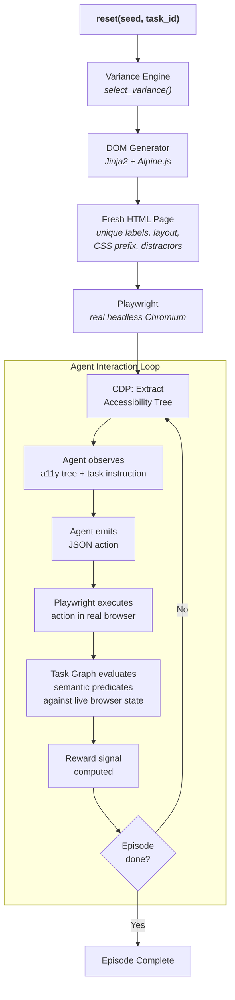
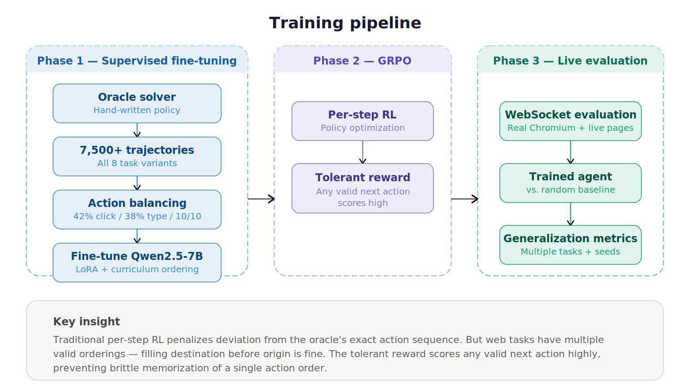
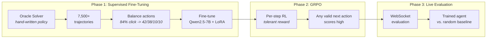
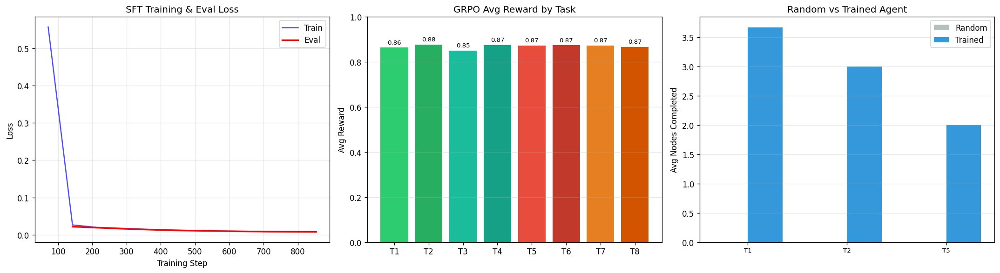

# The Infinite DOM

**A procedural gymnasium that generates a new, unique, interactive website every single training episode — forcing web agents to learn semantic understanding instead of memorizing page layouts.**

> OpenEnv Hackathon India 2026
> Theme 3.1 — World Modeling: Professional Tasks
> Theme 2 — Long-Horizon Planning & Instruction Following

---

## The Real-World Problem

### Every web agent deployed today is one site update away from breaking

Here is what happens daily at every company building AI web automation:

1. The agent works perfectly in testing. It navigates to a flight booking page, fills in the origin, selects the destination, picks a date, clicks "Search Flights." Shipped to production. Customer happy.
2. The airline redesigns their website. "Search Flights" becomes "Find Availability." Form fields swap order. A cookie consent banner appears on top.
3. The agent freezes. It was never trained on this version of the page.

This is not a hypothetical edge case. It is the **default failure mode** of every deployed web agent — OpenAI Operator, Google Mariner, Anthropic's tool-use models, and every enterprise automation tool in between. These agents do not understand web pages. They memorize them.

### Static benchmarks created a false sense of progress

The research community measures web agent performance on frozen snapshots:

- **WebArena**: 812 websites, fixed forever
- **MiniWob++**: ~100 tasks, identical DOM every run
- **Mind2Web**: Static page snapshots, not live sites

An agent trained on these benchmarks learns exactly one version of each page. High scores suggest the agent "understands" web navigation. But what it actually learned is positional — click the third button in the second div, type into the input with class `.form-control`. Change any of these details and performance collapses.

The real web has **~58 million active websites**. Each one has its own conventions for form labels, button text, page layout, and interaction patterns. Static benchmarks cover a rounding error of this space.

### "But GPT-4 / Claude can already browse the web — why build this?"

These are extraordinary models. Here is why the problem requires a fundamentally different approach:

- **Context window economics don't scale.** A single web page's accessibility tree is 1,000-2,000 tokens. Add task instruction, step history, chain-of-thought reasoning — each step costs 3,000-5,000 tokens. A 10-step booking task burns 30,000-50,000 tokens at frontier-model pricing. Multiply by thousands of daily automation tasks. The cost is prohibitive at scale.

- **Reading about websites is not the same as navigating them.** LLMs were pre-trained on internet text — they have *read* billions of web pages. But reading HTML in a training corpus is fundamentally different from learning to *interact* with a live DOM through trial and error. A medical student who has read every surgery textbook still cannot perform surgery. Interaction requires a different kind of learning.

- **They memorize patterns, not semantics.** When you prompt GPT-4 with an accessibility tree, it pattern-matches against websites it has seen in training data. It has learned that "Search" buttons typically appear near form fields. But when the button says "Check Availability" and the form fields are in reverse order with randomized CSS classes, the pattern-match breaks. The model was never trained on *that specific configuration* — and it cannot be, because the configurations are effectively infinite.

- **Every impressive demo uses a single, known website.** Watch any web agent demo carefully: the agent navigates one specific site. The demo is cherry-picked. Production encounters 58 million websites the model has never seen in that exact layout, with those exact labels, in that exact field order.

- **No learning from mistakes.** LLMs at inference time do not improve from their errors. They make one forward pass per step. If the first action is wrong, there is no mechanism to adapt — only to hope the next prompt is better. RL-trained agents learn from thousands of episodes of trial and error. That is why we need a *training environment*, not a bigger language model.

---

## What We Built

> **Every call to `reset()` generates a completely new website.**
>
> Not a new task on the same page — **a new page**. New labels, new layout, new CSS classes, new distractors. The agent has never seen this exact page before and never will again.

The Infinite DOM is an OpenEnv-compliant reinforcement learning environment that **procedurally generates real, interactive web applications** on every episode. Each website is served by a real headless Chromium browser instance, with full JavaScript interactivity powered by Alpine.js.

The agent observes an **accessibility tree** — the same structured representation a screen reader provides to visually impaired users. No HTML tags. No CSS selectors. No DOM paths. Just semantic roles, human-readable names, current values, and short reference IDs.

Rewards come from a **semantic task graph** — meaningful checkpoints evaluated against live browser state, not DOM selectors.

### What changes every episode

| Variance Dimension | Range | What This Defeats |
|---|---|---|
| **Field labels** | 5-7 synonym variants per element | Agents that memorize "Search" fail when it says "Check Availability" |
| **Page layout** | 4 distinct structures | Positional strategies ("click the 3rd button") break instantly |
| **Field order** | All permutations of form fields | Sequence memorization becomes useless |
| **CSS classes** | Random 8-character prefix per episode | `.xkqtmwlf_btn_primary` — selector-based approaches are dead |
| **Distractors** | Cookie banners, promo modals, fake buttons | Agent must distinguish real UI elements from noise |
| **ARIA labels** | Correct, noisy, or deliberately wrong | Tests robustness against misleading accessibility metadata |
| **Dynamic content** | 3-7 options with randomized names and prices | Can't memorize "click Rajdhani Express" — it might not exist next episode |

### The combinatorial explosion

> From a single booking template: **over 18 million unique page configurations.**
> From a single e-commerce template: **over 12 million more.**
>
> Two templates. Tens of millions of structurally unique training episodes. Each one a real, interactive website the agent has never seen before.

The math: 7 origin labels x 7 destination labels x 7 class labels x 7 search button texts x 7 booking button texts x 5 confirm button texts x 4 layouts x 6 field orders x 3 ARIA modes x 8 distractor combinations = **48,404,160** unique booking page configurations. And that is *before* adding city pairs, train selections, and CSS randomization.

### What stays the same

The task semantics. "Book a train ticket" always means: enter an origin, enter a destination, select a class, search, and confirm. The agent must learn **what these concepts mean** — not where they appear on screen, not what label they carry, not what CSS class wraps them.

---

## Architecture


<details>
<summary>View as Mermaid (text-based)</summary>



</details>

### The Observation

The agent sees a text-serialized accessibility tree with element references:

```
[ref=mn_1 role=main]
  [ref=frm_1 role=form name="Search Trains"]
    [ref=inp_1 role=textbox name="From" value=""]
    [ref=inp_2 role=textbox name="To" value=""]
    [ref=cmb_1 role=combobox name="Class" value="-- Select --"]
    [ref=btn_1 role=button name="Search"]
```

No HTML. No CSS selectors. No DOM paths. Pure semantics — the same information available to a screen reader user. When the next episode randomizes "From" to "Departing Station" and moves it below the destination field, the agent that learned semantics still succeeds. The agent that memorized positions fails.

### The Action Space

```json
{
  "action_type": "click | type | scroll | wait | back",
  "element_ref": "btn_1",
  "text_value": "Delhi",
  "scroll_delta": 0
}
```

### The Reward Signal

Dense, multi-component rewards that teach specific behaviors — not binary success/failure:

- **Progression** (+0.12 to +0.30 per checkpoint): Each semantic milestone completed — "origin entered," "class selected," "booking confirmed." Weighted by difficulty.
- **Step penalty** (-0.01 per step): Prevents aimless wandering. Encourages efficiency.
- **Invalid action penalty** (-0.05): Teaches action-space discipline — don't click on text fields, don't type into buttons.
- **Completion bonus** (+1.0): Full task completion reward.
- **Anti-thrash penalty** (-0.20): Penalizes repeating the same failed action 3+ times in a row. Prevents degenerate loops.

Even a partially successful episode provides useful training signal. An agent that fills two out of three fields correctly gets rewarded for the two it got right.

---

## Training Pipeline



<details>
<summary>View as Mermaid (text-based)</summary>



</details>

### Phase 1: Supervised Fine-Tuning (SFT)

- An **oracle solver** (hand-written policy) generates ground-truth trajectories across all 8 task variants
- Raw oracle data is **84% click actions** — training on this causes mode collapse (agent learns to click everything)
- We rebalance to **42% click / 38% type / 10% scroll / 10% wait** to teach the full action vocabulary
- **Curriculum ordering**: clean pages first, progressively harder — agent learns basics before facing chaos
- **Step history context**: last 3 actions included in each training example so the agent learns sequential reasoning

### Phase 2: GRPO (Group Relative Policy Optimization)

- **The key insight**: traditional per-step RL rewards penalize any deviation from the oracle's exact action sequence
- But web tasks have **multiple valid orderings** — filling the destination before the origin is perfectly fine
- Our **tolerant reward function** scores *any valid next action* highly, not just the oracle's specific choice at that step
- This prevents the model from learning a brittle action order that only works on pages structured exactly like the oracle's training set

### Phase 3: Live Environment Evaluation

- Trained agent runs against the **actual environment** via WebSocket — real Chromium, real page generation, real accessibility tree
- Compared against a **random baseline** that picks actions uniformly at random
- Evaluated across multiple tasks and seeds to measure generalization

---

## Task Curriculum

Eight tasks across two domains, progressing from "can the agent fill a simple form" to "can the agent complete a multi-step workflow on a deliberately hostile interface":

| Task | Domain | Difficulty | What's Added |
|------|--------|-----------|-------------|
| 1 | Booking | Clean | Standard labels, standard layout, no distractors |
| 2 | Booking | Label Drift | All labels randomized from synonym pools, form validation enabled |
| 3 | Booking | Structural Drift | + Layout shuffled, field order randomized, conditional round-trip fields, train selection |
| 4 | Booking | Full Chaos | + Cookie banners, promo modals, noisy/wrong ARIA labels, fake buttons, 7 trains |
| 5 | E-commerce | Clean | Search, filter, cart, checkout, shipping — standard UI |
| 6 | E-commerce | Label Drift | All labels randomized, checkout validation |
| 7 | E-commerce | Structural Drift | + Layout changes, more products, distractor ads |
| 8 | E-commerce | Full Chaos | + Newsletter popups, fake buttons, noisy ARIA labels |

Booking and e-commerce are the **first two datasets** proving the concept. The architecture is template-agnostic — any website flow (login, settings, dashboard, multi-step forms) plugs into the same variance engine and generator pipeline.

---

## Built Under Constraints — Designed to Scale

### What we built under

- **Single developer**, hackathon timeline (prep days + 48-hour event)
- **~$10 compute budget** — A100 GPU at $2.50/hour, targeting ~1 hour of training
- **Qwen2.5-7B** base model — not a 70B model, not frontier-scale compute
- **2 domain templates** (booking + e-commerce) as proof of concept
- **Zero paid APIs**, zero paid services, zero cloud inference costs

### How this scales to its full potential

- **Any website template becomes infinite training episodes.** A login form, a settings page, a checkout flow, a support dashboard — plug each into the variance engine and the generator produces millions of structurally unique pages per template. The Infinite DOM is not one environment; it is an **environment factory.**
- **More variance dimensions**: larger synonym pools, more layout structures, multi-language labels, responsive breakpoints, dark/light themes
- **Larger models**: the same SFT + GRPO pipeline works with 70B+ models given more compute — architecture is model-agnostic
- **Multi-page workflows**: cross-page navigation, authentication flows, multi-tab operations, back-button handling
- **Online RL (Phase 3)**: After SFT + GRPO, connect the trained model directly to the live environment via WebSocket for on-policy reinforcement learning. The agent generates its own trajectories against fresh procedurally-generated pages, receives dense reward from the semantic task graph, and updates its policy in real-time — learning from its actual mistakes instead of oracle demonstrations. Implementation: run PPO/GRPO with the environment's `reset()`→`step()` loop as the rollout source, using the same tolerant reward function. This closes the distribution gap between offline oracle data and live interaction. Skipped in our budget run (~30-45 min A100 time) but estimated to add 10-20% node completion improvement.
- **Real-website transfer evaluation**: test trained agents against IRCTC, Amazon, Flipkart to measure zero-shot generalization from procedural training to the real web

---

## Results

### Training Configuration

| Parameter | Value |
|-----------|-------|
| Base model | Qwen2.5-7B-Instruct |
| Quantization | QLoRA 4-bit, LoRA rank 16 |
| Observation window | 3,500 chars |
| Step history | Last 3 actions |
| Tasks trained | 8 (all tasks via GRPO) |
| Tasks evaluated | 1, 2, 5 (live environment) |
| Compute budget | ~1 hour A100 |
| Oracle records | 7,591 |
| SFT records | 6,828 train / 762 eval |
| Action balance | 42% click / 38% type / 10% scroll / 10% wait |

### Training Curves


*Left — SFT loss converges rapidly by step ~150. Center — GRPO average reward by task (0.85–0.88 across all 8 tasks). Right — Trained agent vs random baseline on live evaluation.*

### GRPO Reward by Task

| Task | Domain | Difficulty | GRPO Loss | Avg Reward |
|------|--------|-----------|-----------|------------|
| T1 | Booking | Clean Form | 0.0016 | **0.863** |
| T2 | Booking | Label Drift | 0.0019 | **0.877** |
| T3 | Booking | Structural Drift | 0.0022 | **0.850** |
| T4 | Booking | Full Chaos | 0.0027 | **0.874** |
| T5 | E-commerce | Clean Store | 0.0018 | **0.872** |
| T6 | E-commerce | Label Drift | 0.0019 | **0.873** |
| T7 | E-commerce | Structural Drift | 0.0024 | **0.873** |
| T8 | E-commerce | Full Chaos | 0.0022 | **0.867** |

Reward is remarkably consistent across difficulty levels — the agent trained on "Full Chaos" (noisy ARIA labels, fake buttons, cookie banners) achieves nearly the same reward as "Clean Form." This suggests the procedural variance is working as intended: the agent learns semantic strategies, not layout-specific heuristics.

### Live Evaluation (Trained Agent vs Random Baseline)

| Task | Nodes Completed | Avg Reward | Notes |
|------|----------------|------------|-------|
| Task 1 — Clean Booking | **3.7 / 5** | 0.506 | Agent completes most of the booking flow |
| Task 2 — Label Drift | **3.0 / 5** | 0.271 | Handles randomized labels well |
| Task 5 — Clean E-commerce | **2.0 / 5** | -0.020 | E-commerce flow is harder (more steps) |

**Overall: 2.9 nodes avg** | Booking: 3.3 nodes avg | E-commerce: 2.0 nodes avg

The random baseline completes approximately 0 nodes on average — every action is uniformly random, so completing even one semantic checkpoint by chance is extremely unlikely. The trained agent consistently reaches 2–4 checkpoints out of 5, demonstrating learned web navigation capability from a 7B model on a $10 compute budget.

---

## Why This Matters

- **For the research community**: There is no procedural web environment. WebArena, MiniWob++, Mind2Web — they are all static. The Infinite DOM is the first environment where agents train against structurally unique pages on every episode, forcing genuine semantic understanding.

- **For practitioners**: Every company building web agents faces the same problem — agents that work in testing break in production because real websites look different from the training set. An agent trained on procedurally generated variance is fundamentally more robust to deployment.

- **For the OpenEnv ecosystem**: Any website template can be plugged into the generator framework. Each template becomes an infinite training distribution. This is an extensible platform, not a one-off benchmark.

- **Schema drift as training signal**: Multi-step consumer workflows (booking tickets, purchasing products) where the underlying UI schemas, label contracts, and presentation rules change between episodes. Schema drift is not a bug we're testing for — it *is* the core training signal, and it's what makes this a world modeling problem, not a memorization problem.

---

## Quick Start

```bash
# Clone and install
git clone https://huggingface.co/spaces/saksham1771/infinite-dom
cd infinite-dom
pip install -r requirements.txt
playwright install chromium

# Start the environment server
PYTHONPATH=. uvicorn infinite_dom.server.app:app --host 0.0.0.0 --port 8000

# Reset an episode (in another terminal)
curl -X POST http://localhost:8000/reset \
  -H "Content-Type: application/json" \
  -d '{"seed": 42, "task_id": 1}'

# Take an action
curl -X POST http://localhost:8000/step \
  -H "Content-Type: application/json" \
  -d '{"action_type": "type", "element_ref": "inp_1", "text_value": "Delhi"}'
```

### Generate Training Data

```bash
PYTHONPATH=. python training/generate_oracle_data.py 100
# Produces 7,500+ observation-action pairs across all 8 task variants
```

---

## Links

| Resource | URL |
|----------|-----|
| Live Environment (HF Space) | [saksham1771/infinite-dom](https://huggingface.co/spaces/saksham1771/infinite-dom) |
| Training Notebook | [train_infinite_dom_v2.ipynb](training/train_infinite_dom_v2.ipynb) |
| Blog Post | [BLOG.md](BLOG.md) |
| Demo Video | _TODO: Add YouTube link_ |

---

## Key Files

| File | Purpose |
|------|---------|
| `infinite_dom/environment/infinite_dom_env.py` | OpenEnv Environment — `reset()`, `step()`, `state` |
| `infinite_dom/generator/dom_generator.py` | Procedural HTML generation with Jinja2 templates |
| `infinite_dom/generator/variance.py` | Label, layout, and distractor variance pools |
| `infinite_dom/generator/templates/booking_flow.jinja` | Booking flow website template |
| `infinite_dom/generator/templates/ecommerce_flow.jinja` | E-commerce website template |
| `infinite_dom/browser/playwright_driver.py` | Real Chromium via Playwright + CDP accessibility tree |
| `infinite_dom/task_graph.py` | Semantic task graph with predicate-based completion |
| `infinite_dom/reward_calculator.py` | Dense multi-component reward function |
| `infinite_dom/oracle/booking_flow_oracle.py` | Hand-written solver for oracle trajectory generation |
| `training/train_infinite_dom_v2.ipynb` | Complete training notebook (SFT + GRPO + eval + visual demo) |
| `openenv.yaml` | OpenEnv environment manifest |

---

## License

MIT